# reports on Lenet

> LU Jialin 3140102299

> luxxxlucy@gmail.com

implemented lenet on Mnist dataset using frameworks: tensorflow, pytorch and keras

## Usage

### prequiste

you will need many things, but fortunately all is easy to install and cofigue.

- python
- tensorflow
- tensorboard
- tqdm: this was used for logged imfo
- pytorch
- keras

### run

run like this

```
python main.py  --train --train_num 1000 --load --framework tensorflow
```

- --train : indicate that you want to train the model. If this flag is set on, a --train_num must followed
- --load : use while you want to load a local model
- --framework: choose your framework: tensorflow, pytorch or keras ...

> there are other flags, like the --log_dir indicating the directory to store the log info

## Experiments

### Original Lenet

#### Architecture of Lenet


#### tables&graph

this is the default setting of Lenet.

As you can see, the performance of this model (97.36%) is remarkably high.

> In following sections, I need to say very clearly that I was using a seperated independent part of data for validation. And I call it the **test set**.

 

But the architecture and performance along can tell nothing, I did some experiments on some modifications on the network structure. Only by difference can we see the progress.

### Test on variations of Lenet

#### Variation: add a conv&pool layer

this time we add a convolution to make the model a 3-conv-layer model.

note the original two previous conv&pool map the original 28_28_1 to 14_14_32 and then 7_7_64\. I add a conv and a same size pooling layer to map it to 7_7_128\. (So the followed fully-connected layer's parameters are also changed).

I try to maintain the architecture as similar as possible but there are inevitable modifications which must be made.

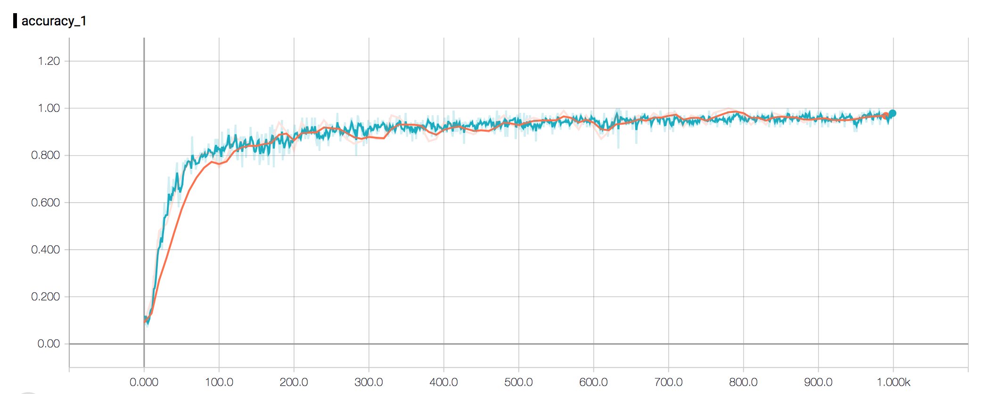 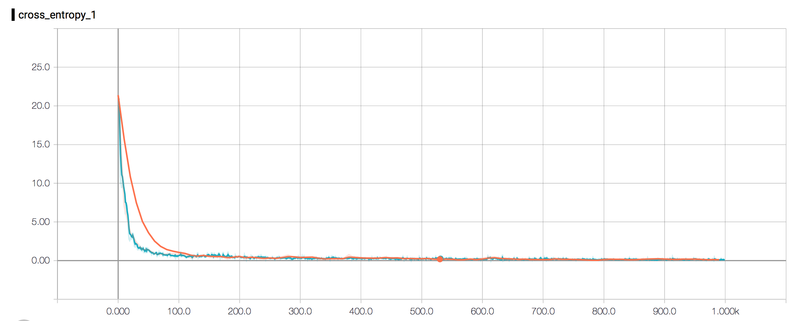

As you can see the final accuracy is about 96.38%, which is a little bit bad than the orignal structure 97.36%. But if you look closer into the graph, you will find that the problem might be that there are too many parameters to train thus the model is trapped in a local minima.

Take the first 50 epoch for example you can the the trend of progess on test set and train set are almost identical. It is only the model with one more conv&pool layer is making improvement a little bit slower( by slower, I mean that to achieve the same value of accuracy or entropy error, the more complex may take more epoch of training.)

So even the final accuracy of 1000 epoch is not so good compared with the orignal structure, it is still very promising cause it is natural to assume that its performance would continue growing better.

#### Variation: Change the size of conv kernel

In this variation I only did one thing: I change the conv kernel size of the second conv layer from 5_5 to 7_7.

The final performance after 1000 epoch is 97.33%

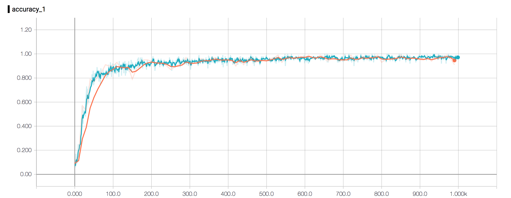 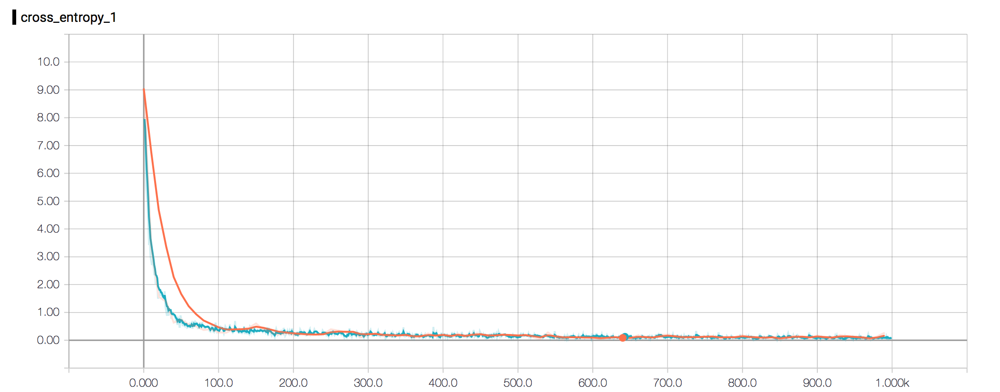

From the picture you can see everything are close to the original setting. But there is stil one thing worth mentioning: **generalization**.

I guess the major difference would be in the situation of around epoch 100, the difference of performance on test set is

#### Variation: Change the number of conv kernels

In this variation I change the number of kernel size, the original setting is:

1. first conv: 1->32
2. second conv: 32->64

I changed it to:

1. first conv: 1->16
2. second conv: 16->32

I think that it is a natural setting as well, just divide the size by two.

The final performance after 1000 epoch is 96.8%

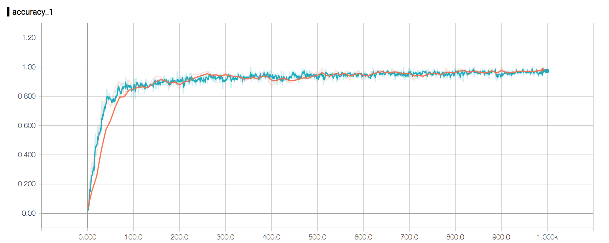 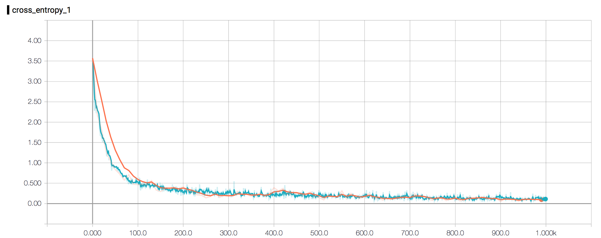

#### Variation: Change the activation function

Acutally in my implementating the orginal setting I was using relu, so in this section in order to find the difference to activations, I change it to sigmoid.

For all layers and every activation, I change to sigmoid.

The final performance after 1000 epoch is 86.93%

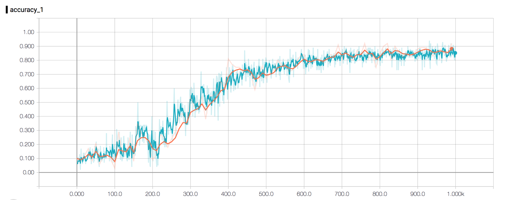 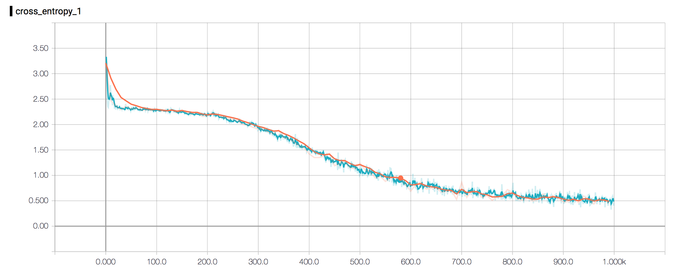

this is actually the most dramatical episode by now. It appears the non-linear mapping function has a huge impact on the training result. The non-linear mapping's impact I think is due to the back propagation, since if you use different function the gradients would be different. I guess the bad performance of sigmoid is only a matter of speed of convergence. Relu is clearly simpler and quicker for gradient descent but sigmoid on the other hand, was too delicate thus slow.

#### Variation: Change the last fully-connected layer's size

In the original setting the size of fc layer is 1024\. I decrease the size dramatically to 128.

The final performance after 1000 epoch is 95.84%.

I think it is purely a lack of model's ability of express. You only leave these size of nodes, you deserve a huge degrade on performance.

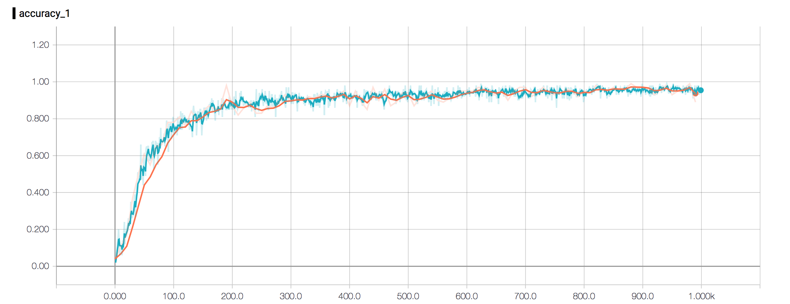 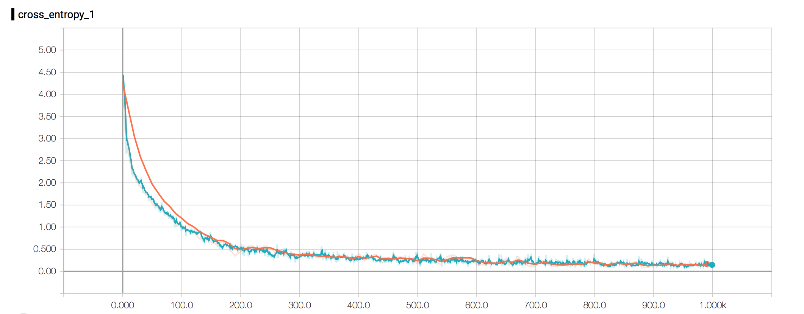

#### Variation: Add another fully-connected layer

I add another fully-connected layer from 1024 to 128 then into the output layer.

The final performance after 1000 epoch is 96.7%.

Slightly better than the formal one. But the problem here (if you look closer to the still state of trainning error) is that a local minimum is entered and there is no way for it to get out. It is dead, and there is no way to fix it cause differentiated parameters are hard to tune.

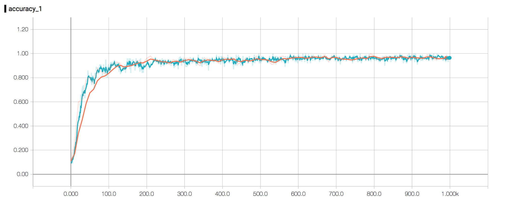 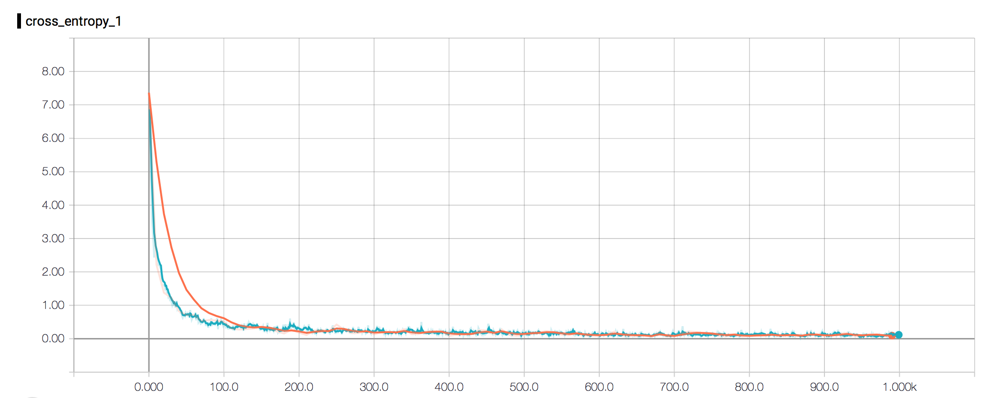
